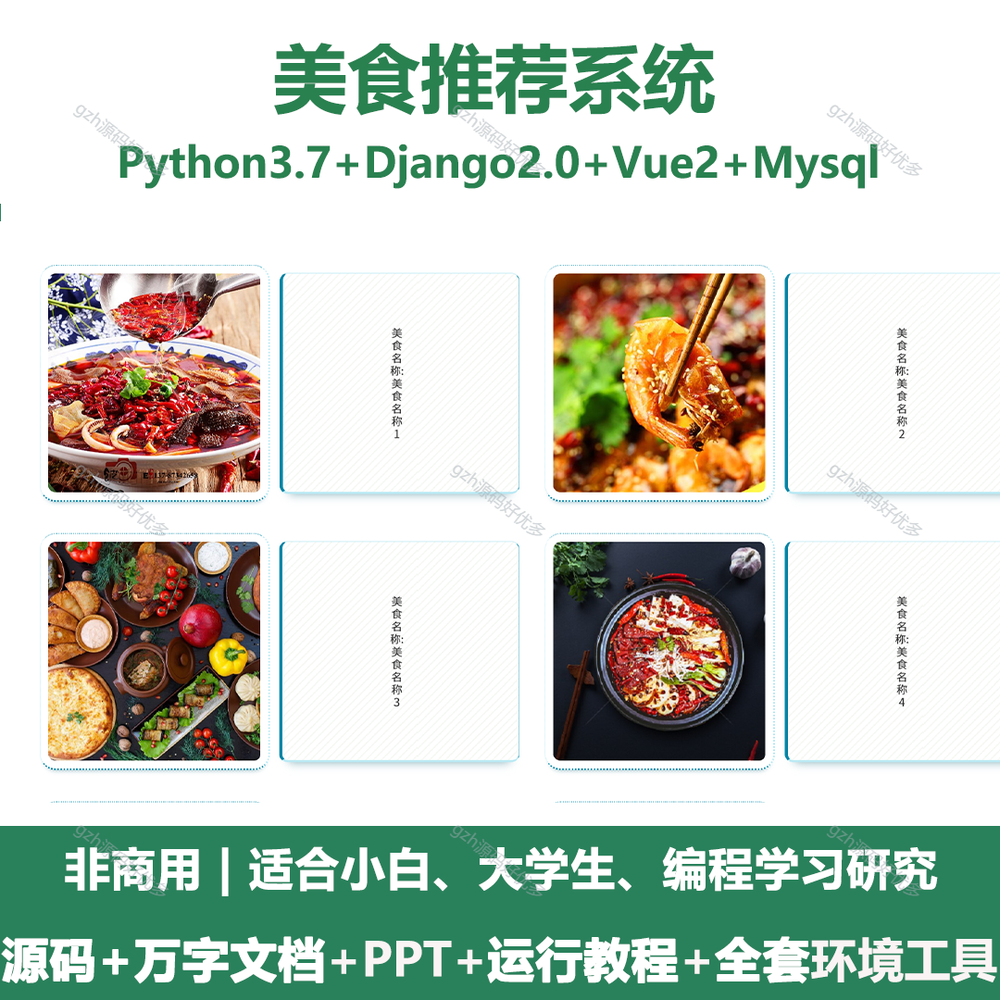
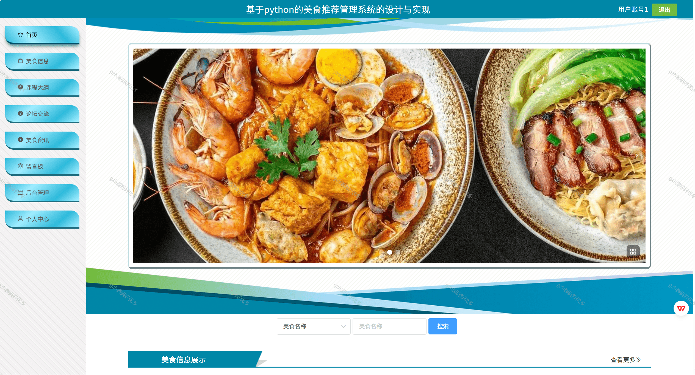
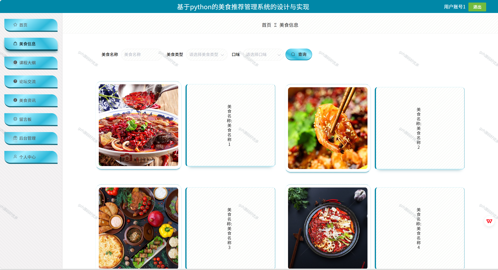
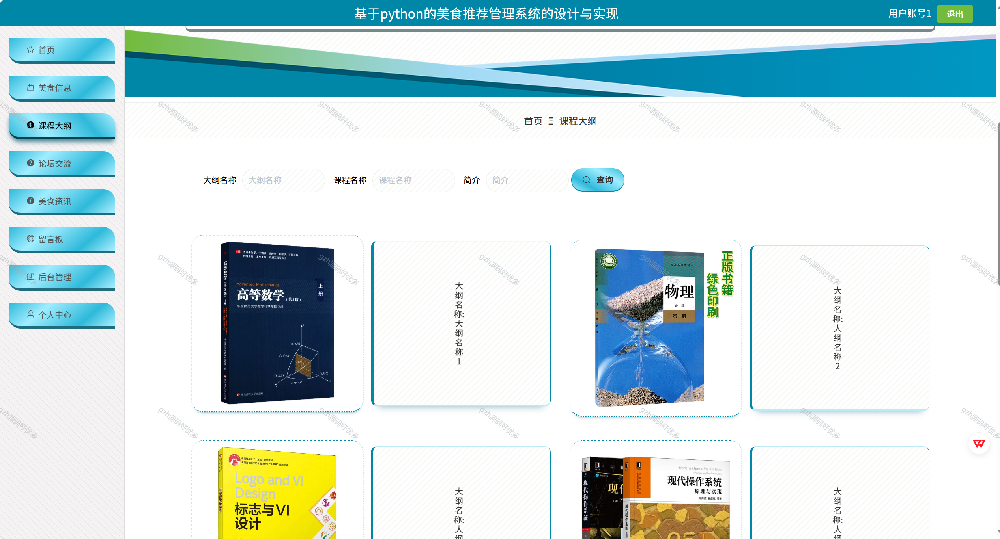
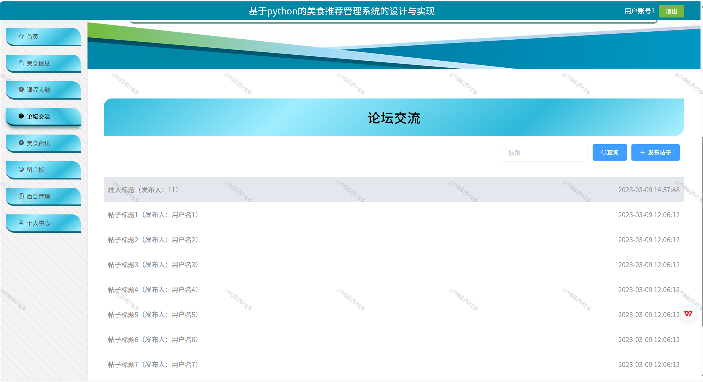
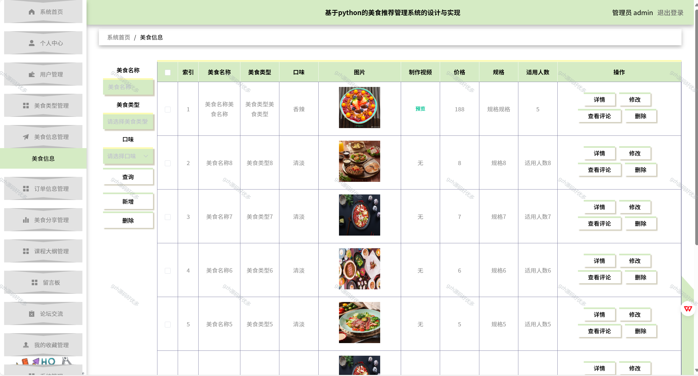
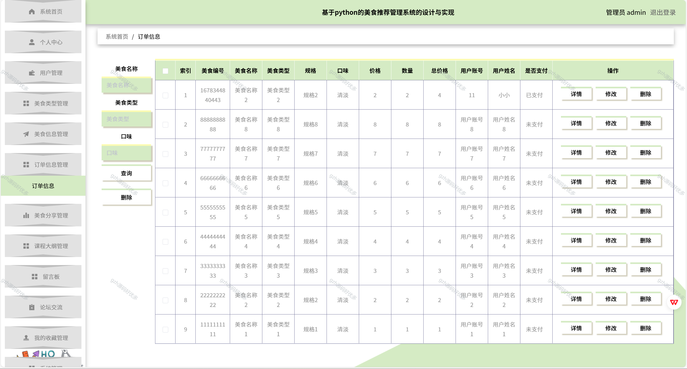
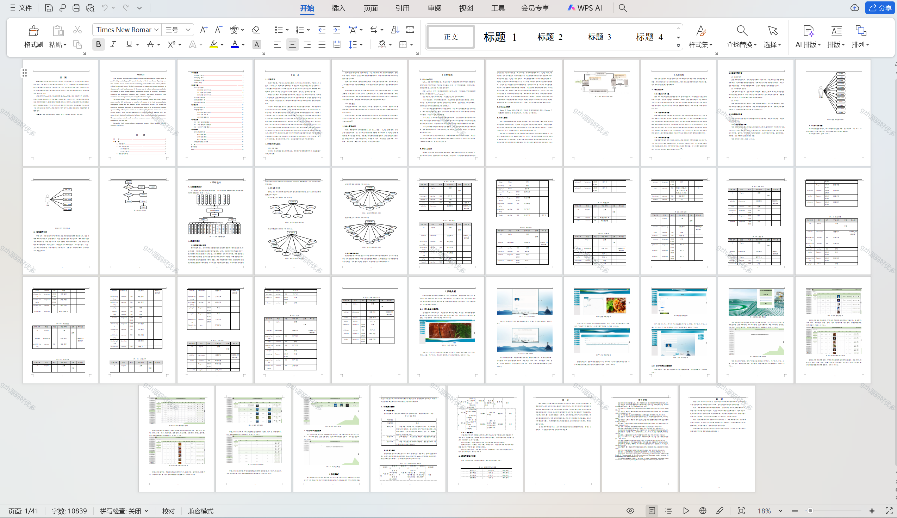

# python071
python071基于Python+Django的美食推荐系统+LW+PPT
 
## 查看主页获取源码

### 一、关键词
美食推荐平台，餐饮推荐系统，菜品推荐系统

### 二、作品包含
源码+数据库+万字设计文档+PPT+全套环境和工具资源+本地部署教程

### 三、项目技术
前端技术：Vue2.0、Element-ui
后端技术：Python3.7、Django2.0

### 四、运行环境（以下版本亲测，其他版本兼容性请自行测试）
开发工具：PyCharm + VSCODE

数据库：MySQL5.7（最低要5.7版本）

数据库管理工具：Navicat10+

Python：Python3.7

前端Nodejs：14

浏览器：谷歌浏览器

### 五、项目介绍
项目编号：python071

为解决用户需求，美食推荐管理系统发展愈发多元化与网络化，与电子信息技术相结合。美食推荐管理系统应运而生。
系统由管理员功能模块和用户功能模块组成。不同角色的准入制度是有严格区别的。各功能模块的设计也便于以后的系统升级和维护。该系统采用了软件组件化、精化体系结构、分离逻辑和数据等方法。

### 六、运行截图

